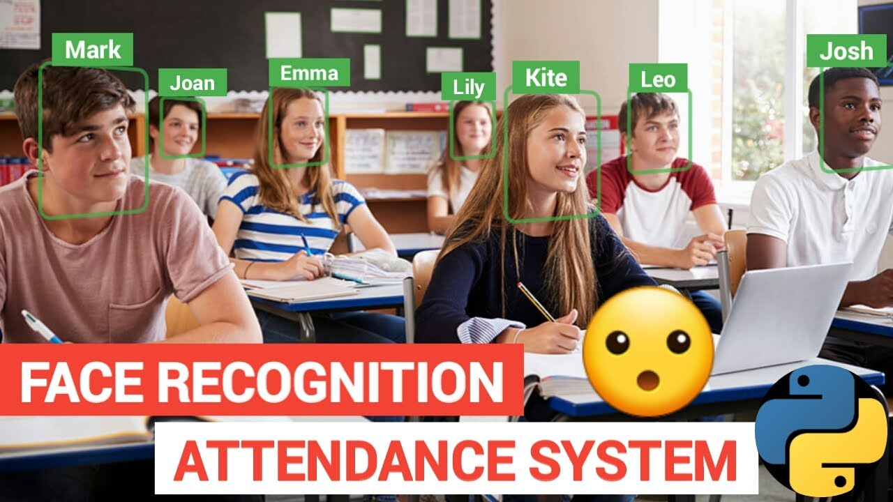

# Students attendance using opencv and esp32-cam 

## Project Intro
deeplearning model responsible for detecting faces to take student's attendance

### Requirements
* Esp32-cam / laptop cam
* pre trained model VGG16
* transfer learning
* Deep leanring, CNN
* Early stopping
  
### Technologies
* pandas, numpy, matplotlib
* tensotflow
* glob
* scikit learn 

## Project Description
the purpose of this project is to create a deeplearning model resposible for detecting ct scan for lunges predicting if it's one of the following classes 
**{0:'failure',1:'normal',2:'Covid',3:'lung atama'}** 
then the model should be deployed on mobile application and all data exchange will be done by GET and POST request, provided down screenshot of a post request to my local host running the model and getting back predictions in a json format 

## image preprocessing

it's essential to preprocess the image uploaded before passing it to the model  
and getting back the prediction 
and all these preprocesssing procedure should be matched to whatever your model expecting to get to start getting predictions

## Needs of this project

- data processing/cleaning
- app developer
- Deep learning model

## Getting Started

1. pull the docker image **docker pull <image_name>:<tag>** from [Here](https://hub.docker.com/repository/docker/omar88/docker_app/tags) Ensure Docker is installed on your system  You can download and install Docker from the official Docker [website](https://www.docker.com/get-started)
2. List Docker Images **docker images** (Optional): You can list the Docker images on your system to verify that the image has been successfully pulled
3. Run Docker Container **docker run <options> <image_name>:<tag>**

## [Contact](https://www.linkedin.com/in/omar-magdy-197a88215/)
